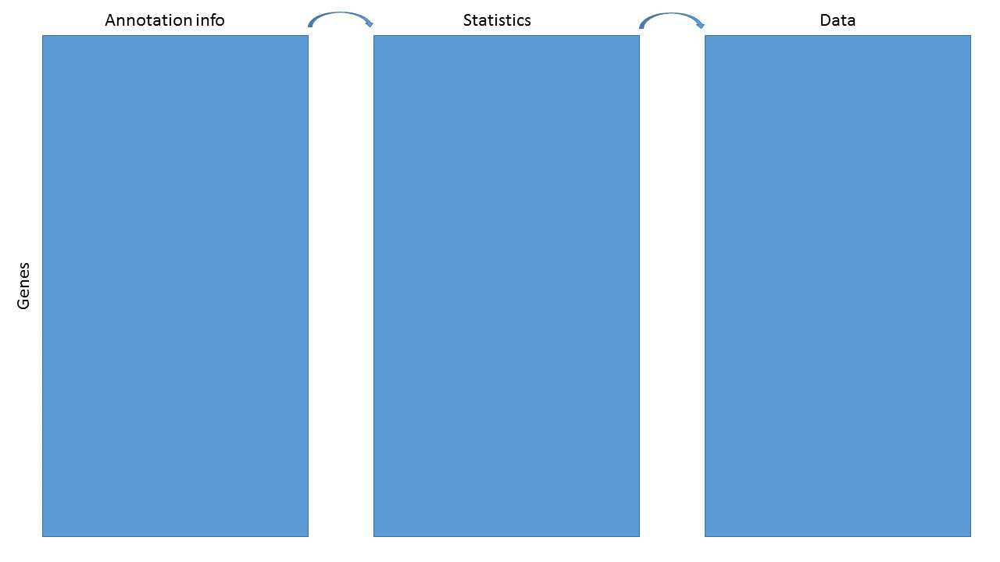
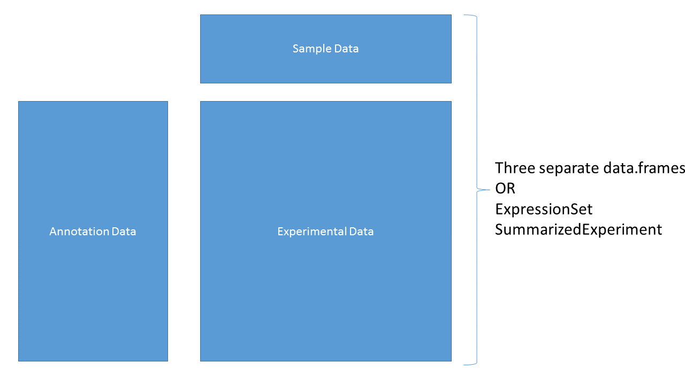

<style scoped>
ul > li:before {
    color: #1a81c2;
    vertical-align: middle;
    font-family: "Arial Black";
    font-weight: 900;
    margin-left: -.85em;
	}
	</style>


## Goals for this workshop

- Learn about various annotation package types

- Learn the basics of querying these resources

- Other stuff

```{r setup, include = FALSE}

library(BiocAnno2016)
library(hugene20sttranscriptcluster.db)
library(EnsDb.Hsapiens.v79)
library(org.Hs.eg.db)
library(TxDb.Hsapiens.UCSC.hg19.knownGene)
library(Homo.sapiens)
library(BSgenome)
library(BSgenome.Hsapiens.UCSC.hg19)


```


## What do we mean by annotation?

Map a known ID to other functional or positional information


## Specific goal

We have data and statistics, and we want to add other useful
information



The end result might be as simple as a data.frame or HTML table, or as complex as a
`RangedSummarizedExperiment`

## Data containers



## ExpressionSet


```{r}

getEset()
eset

```
## ExpressionSet (continued)

```{r}

head(exprs(eset))
head(pData(phenoData(eset)))


```
## ExpressionSet (continued)

```{r}

head(pData(featureData(eset)))


```

## BioC containers vs basic structures

### Pros

* Validity checking

* Subsetting

* Function dispatch

* Automatic behaviors

### Cons

* Difficult to create

* Useful only within R

## Annotation sources

```{r, results = "asis", echo = FALSE}

df <- data.frame("Package type" = c("ChipDb","OrgDb","TxDb/EnsDb","OrganismDb","BSgenome","Others","AnnotationHub","biomaRt"),
                 Example = c("hugene20sttranscriptcluster.db","org.Hs.eg.db","TxDb.Hsapiens.UCSC.hg19.knownGene; EnsDb.Hsapiens.v75",
                             "Homo.sapiens","BSgenome.Hsapiens.UCSC.hg19","GO.db; KEGG.db", "Online resource","Online resource"), check.names = FALSE)
knitr::kable(df)

```


## Interacting with AnnoDb packages

The main function is `select`:

select(*annopkg*, *keys*, *columns*, *keytype*)

Where

* annopkg is the annotation package

* keys are the IDs that we **know**

* columns are the values we **want**

* keytype is the type of key used
    + if the keytype is the **central** key, it can remain unspecified


## Simple example

Say we have analyzed data from an Affymetrix Human Gene ST 2.0 array
and want to know what the genes are. For purposes of this lab, we
just select some IDs at random.

```{r}

library(hugene20sttranscriptcluster.db)
set.seed(12345)
ids <- featureNames(eset)[sample(1:25000, 5)]
ids
select(hugene20sttranscriptcluster.db, ids, "SYMBOL")


```


## Questions!

How do you know what the central keys are?

>- If it's a ChipDb, the central key are the manufacturer's probe IDs

>- It's sometimes in the name - org.Hs.eg.db, where 'eg' means Entrez
>  Gene ID

>- You can see examples using e.g., head(keys(*annopkg*)), and infer
>  from that

>- But note that it's never necessary to know the central key, as long
>  as you specify the keytype

## More questions!

What keytypes or columns are available for a given annotation package?

```{r}

keytypes(hugene20sttranscriptcluster.db)
columns(hugene20sttranscriptcluster.db)

```
## Another example

There is one issue with `select` however.

```{r}

ids <- c('16737401','16657436' ,'16678303')
select(hugene20sttranscriptcluster.db, ids, c("SYMBOL","MAP"))


```
## The `mapIds` function

An alternative to `select` is `mapIds`, which gives control of
duplicates

* Same arguments as `select` with slight differences

    - The columns argument can only specify one column

    - The keytype argument **must** be specified

    - An additional argument, multiVals used to control duplicates

```{r}

mapIds(hugene20sttranscriptcluster.db, ids, "SYMBOL", "PROBEID")

```

## Choices for multiVals

Default is `first`, where we just choose the first of the
duplicates. Other choices are `list`, `CharacterList`, `filter`,
`asNA` or a user-specified function.

```{r}

mapIds(hugene20sttranscriptcluster.db, ids, "SYMBOL", "PROBEID", multiVals = "list")


```

## Choices for multiVals (continued)

```{r}

mapIds(hugene20sttranscriptcluster.db, ids, "SYMBOL", "PROBEID", multiVals = "CharacterList")
mapIds(hugene20sttranscriptcluster.db, ids, "SYMBOL", "PROBEID", multiVals = "filter")
mapIds(hugene20sttranscriptcluster.db, ids, "SYMBOL", "PROBEID", multiVals = "asNA")


```
## ChipDb/OrgDb questions

Using either the hugene20sttranscriptcluster.db or org.Hs.eg.db package,

* What gene symbol corresponds to Entrez Gene ID 1000?

* What is the Ensembl Gene ID for PPARG?

* What is the UniProt ID for GAPDH?

* How many of the probesets from the ExpressionSet (eset) we loaded map to a
  single gene? How many don't map to a gene at all?

## TxDb packages

TxDb packages contain positional information; the contents can be
inferred by the package name

**TxDb.Species.Source.Build.Table**

* TxDb.Hsapiens.UCSC.hg19.knownGene

	- *Homo sapiens*

	- UCSC genome browser

	- hg19 (their version of GRCh37)

	- knownGene table

TxDb.Dmelanogaster.UCSC.dm3.ensGene
TxDb.Athaliana.BioMart.plantsmart22

## EnsDb packages

EnsDb packages are similar to TxDb packages, but based on Ensembl
mappings

EnsDb.Hsapiens.v79  
EnsDb.Mmusculus.v79  
EnsDb.Rnorvegicus.v79  

## Transcript packages

As with ChipDb and OrgDb packages, `select` and `mapIds` can be used
to make queries

```{r}

select(TxDb.Hsapiens.UCSC.hg19.knownGene, c("1","10"),
       c("TXNAME","TXCHROM","TXSTART","TXEND"), "GENEID")
select(EnsDb.Mmusculus.v79, c("11287", "11298"),
       c("GENEID","GENENAME","SEQNAME","GENESEQSTART","GENESEQEND"), "ENTREZID")

```
But this is not how one normally uses them...

## GRanges

The normal use case for transcript packages is to extract positional
information into a `GRanges` or `GRangesList` object. An example is
the genomic position of all genes:

```{r}

gns <- genes(TxDb.Hsapiens.UCSC.hg19.knownGene)
gns

```
## GRangesList

Or the genomic position of all transcripts **by** gene:

```{r}

txs <- transcriptsBy(TxDb.Hsapiens.UCSC.hg19.knownGene)
txs

```
## Other accessors

* Positional information can be extracted for `transcripts`, `genes`, coding
  sequences (`cds`), `promoters`  and `exons`.

* Positional information can be extracted for most of the above, grouped
  by a second element. For example, our `transcriptsBy` call was all
  transcripts, grouped by gene.

* More detail on these *Ranges objects is beyond the scope of this
  workshop, but why we want them is not.

## Why *Ranges objects

The main rationale for *Ranges objects is to allow us to easily select
and subset data based on genomic position information. This is really
powerful!

`GRanges` and `GRangesLists` act like data.frames and lists, and can
be subsetted using the `[` function. As a really artificial example:

```{r}

txs[txs %over% gns[1:2,]]


```

## *Ranges use cases

* Gene expression changes near differentially methylated CpG islands

* Closest genes to a set of interesting SNPs

* Genes near DNAseI hypersensitivity clusters

* Number of CpGs measured over Gene X by Chip Y

## SummarizedExperiment objects

SummarizedExperiment objects are like ExpressionSets, but the row-wise
annotations are GRanges, so you can subset by genomic locations:


## TxDb exercises

* How many transcripts does PPARG have, according to UCSC?

* Does Ensembl agree?

* How many genes are between 2858473 and 3271812 on chr2 in the hg19
genome?
    - Hint: you make a `GRanges` like this - `GRanges("chr2", IRanges(2858473,3271812))`

## OrganismDb packages

OrganismDb packages are meta-packages that contain an OrgDb, a TxDb,
and a GO.db package and allow cross-queries between those packages.

All previous accessors work; `select`, `mapIds`, `transcripts`, etc.

```{r}

library(Homo.sapiens)
Homo.sapiens


```

## OrganismDb packages

* Updateable - can change TxDb object

* columns and keytypes span all underlying objects

* Calls to TxDb accessors include a 'columns' argument

```{r }

head(genes(Homo.sapiens, columns = c("ENTREZID","ALIAS","UNIPROT")),4)

```

## OrganismDb exercises

* Get all the GO terms for BRCA1

* What gene does the UCSC transcript ID uc002fai.3 map to?

* How many other transcripts does that gene have?

* Get all the transcripts from the hg19 genome build, along with their
  Ensembl gene ID, UCSC transcript ID and gene symbol

## BSgenome packages

BSgenome packages contain sequence information for a given
species/build. There are many such packages - you can get a listing
using `available.genomes`

```{r}

library(BSgenome)
head(available.genomes())

```
## BSgenome packages

We can load and inspect a BSgenome package

```{r}

library(BSgenome.Hsapiens.UCSC.hg19)
Hsapiens

```

## BSgenome packages

The main accessor is `getSeq`, and you can get data by sequence (e.g.,
entire chromosome or unplaced scaffold), or by
passing in a GRanges object, to get just a region.

```{r}

getSeq(Hsapiens, "chr1")
getSeq(Hsapiens, gns["5467",])


```
The Biostrings package contains most of the code for dealing with
these `*StringSet` objects - please see the Biostrings vignettes and
help pages for more information.

## BSgenome exercises

* Get the sequences for all transcripts of the TP53 gene

## AnnotationHub

AnnotationHub is a package that allows us to query and download many
different annotation objects, without having to explicitly install
them.

```{r}

library(AnnotationHub)
hub <- AnnotationHub()
hub


```
## Querying AnnotationHub

Finding the 'right' resource on AnnotationHub is like using Google - a
well posed query is necessary to find what you are after. Useful
queries are based on

* Data provider

* Data class

* Species

* Data source


## AnnotationHub Data providers

```{r}

unique(hub$dataprovider)

```

## AnnotationHub Data classes

```{r}

unique(hub$rdataclass)

```
## AnnotationHub Species

```{r}

head(unique(hub$species))
length(unique(hub$species))

```
## AnnotationHub Data sources

```{r}

unique(hub$sourcetype)

```
## AnnotationHub query

```{r}

qry <- query(hub, c("granges","homo sapiens","ensembl"))
qry

```
## AnnotationHub query

```{r}

qry$sourceurl

```

## Selecting AnnotationHub resource

```{r}

whatIwant <- qry[["AH50377"]]

```
We can use these data as they are, or convert to a TxDb format:

```{r}

GRCh38TxDb <- makeTxDbFromGRanges(whatIwant)
GRCh38TxDb

```
## AnnotationHub exercises

* How many resources are on AnnotationHub for Atlantic salmon (Salmo
  salar)?

* Get the most recent Ensembl build for domesticated dog (Canis
  familiaris) and make a TxDb

## biomaRt

